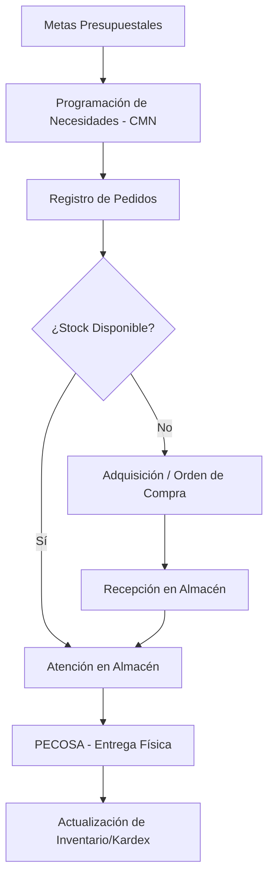

# Flujo de Trabajo: Ciclo de Vida Logístico Integrado

El sistema logístico modela un flujo continuo desde las metas institucionales hasta la entrega física de los bienes.

## Flujo Conceptual de Alto Nivel

## Relaciones Clave

### 1. De la Planificación a la Solicitud (CMN -> Pedidos)
El sistema utiliza el **CMN** como un techo de control. Los pedidos programados se validan contra las "cantidades programadas" para ese mes y centro de costo específico. Esto garantiza que el gasto se alinee con el plan multianual.

### 2. De la Solicitud a la Ejecución (Pedidos -> Almacén vs. Compras)
Tras la autorización de un pedido, el sistema se bifurca:
- Si existe stock (`STOCK`), dirige el flujo a la **Atención en Almacén**.
- Si el stock es insuficiente (`PPTAL`), activa la necesidad de una **Orden de Compra (OC)**.

### 3. Del Ingreso a la Salida (Recepción -> Entrada -> PECOSA)
Los bienes que ingresan por compra o donación no están disponibles inmediatamente para su atención. Deben pasar por la **Recepción** (verificación de calidad) y la **Entrada** (incremento oficial de stock) antes de que el procedimiento de **Atención de Pedidos** pueda seleccionarlos para una **PECOSA**.

### 4. De Logística a Patrimonio (Logística -> Patrimonio)
Existe un puente específico para los **Activos Fijos**. Cuando un ítem categorizado como activo ingresa al almacén, el sistema solicita su registro en el módulo de Patrimonio, vinculando la adquisición logística directamente con el inventario institucional.

## Modelo Conceptual Central
El sistema se basa en la **Rendición de Cuentas y el Rigor Presupuestal**. No ocurre ningún movimiento físico sin una meta presupuestal correspondiente y un documento autorizado (Pedido/OC/NEA/PECOSA).
