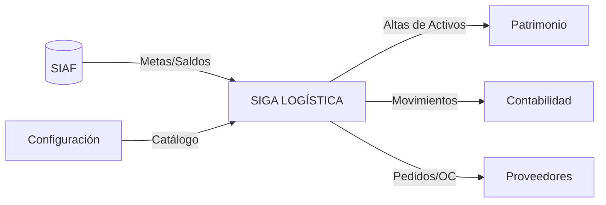

# Mapa de Integración y Fuentes de Datos

El sistema logístico actúa como un orquestador que consume datos de sistemas financieros y produce datos para inventarios patrimoniales.

## Origen de la Información (Inputs)

| Fuente de Datos | Información Provista | Propósito |
| :--- | :--- | :--- |
| **Interfaz SIAF** | Metas, Rubros, Clasificadores, Saldo Pptal. | Garantiza que la logística no gaste más de lo autorizado legalmente. |
| **Módulo Configuración** | Catálogo Institucional, Precios Estimados. | Estandariza qué se puede comprar y a qué precio referencial. |
| **Módulo Personal** | Maestro de Empleados, Centros de Costo. | Define quién solicita y quién es responsable de la recepción. |

## Destino de la Información (Outputs)

| Módulo Destino | Información Enviada | Consecuencia |
| :--- | :--- | :--- |
| **Módulo Patrimonio** | Altas de Activos Fijos (vía Entrada Almacén). | El bien comprado se convierte en un activo institucional rastreable. |
| **Contabilidad** | Asientos de Kardex, PECOSAS. | Sincronización entre el movimiento físico y los estados financieros. |
| **Tesorería** | Obligaciones de Pago registradas en Pedidos. | Programación de pagos a proveedores. |

## Diagrama de Flujo de Datos

