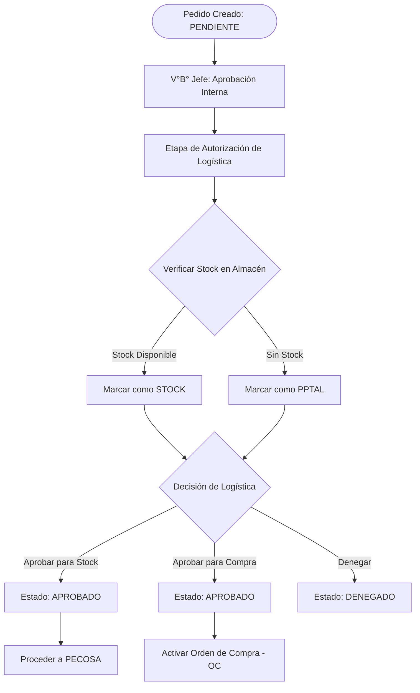

# Procedimiento: Gestión de Pedidos

La Gestión de Pedidos modela la transición de las necesidades planificadas a solicitudes accionables para atención o adquisición.

## Descripción
Este procedimiento maneja la solicitud formal de ítems por parte de los Centros de Costo. El sistema distingue entre ítems ya planificados y requerimientos de emergencia o no programados.

## Tipos de Pedidos
1. **Pedidos Programados**: Basados directamente en los ítems aprobados en el CMN. Estos están restringidos por las cantidades y meses definidos en la fase de planificación.
2. **Pedidos de Compra B/S**: Utilizados para necesidades no programadas. Estos requieren mayores niveles de justificación y validación presupuestal en tiempo real.

## Pasos Clave
- **Registro del Pedido**: Selección de la Meta, Actividad y el empleado responsable de recibir los ítems.
- **Inserción de Ítems**: Adición de ítems específicos desde el catálogo o el CMN aprobado.
- **V°B° Jefe**: Aprobación interna por el jefe del Centro de Costo.
- **Autorización de Logística**: Revisión final por el área de Logística para decidir sobre la atención (desde stock) o la adquisición (compra).

### Lógica de Autorización y Atención de Pedidos

## Requisitos del Sistema
- **Vinculación con el CMN**: Para pedidos programados, el ítem debe tener un saldo remanente en el CMN aprobado para el mes solicitado.
- **Validación Presupuestal**: Para pedidos no programados, el sistema realiza una verificación en tiempo real contra el "Saldo Presupuestal SIAF".
- **Justificación**: Los pedidos no programados requieren que se complete un campo formal de "Justificación" si el ítem estaba originalmente en el CMN pero se solicita fuera del plan.
- **Flujo de Estados**: Los pedidos deben pasar por los estados: `PENDIENTE` -> `VB JEFE` -> `APROBADO`.
