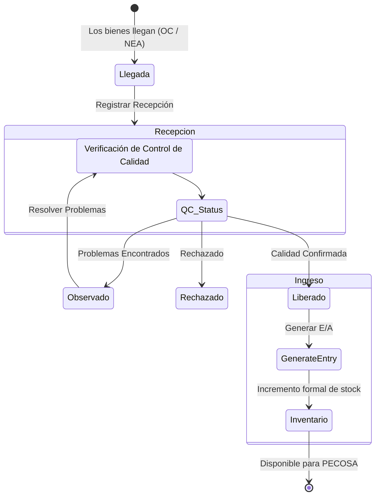

# Procedimiento: Operaciones de Almacén

Las operaciones de almacén modelan el ciclo de vida de los bienes dentro de la organización, desde el ingreso hasta la entrega física.

## Sub-procedimientos
1. **Recepción (Recepción en Almacén)**: La llegada física de los bienes.
    - Fuentes: Órdenes de Compra (OC) o Notas de Entrada al Almacén (NEA).
    - Verificaciones: Cantidades recibidas vs. solicitadas, estado de control de calidad (Liberado, Observado, Rechazado).

### Flujo de Recepción e Ingreso al Almacén

2. **Ingreso (Entradas al Almacén)**: Formalización de la recepción en el inventario.
    - Solo los ítems en estado `Liberado` pueden generar un registro de Entrada.
3. **Atención (Atención de Pedidos)**: Selección de stock para satisfacer pedidos autorizados.
    - Soporta atención Total o Parcial según la disponibilidad de stock.
4. **Documentación de Salida (PECOSA)**: El "Pedido Comprobante de Salida" es el documento legal del sistema para la salida de bienes del almacén.
5. **Control de Inventario**:
    - **Kardex**: Seguimiento de inventario perpetuo utilizando el método de Precio Promedio Ponderado.
    - **Inventario Físico**: Procedimiento de conciliación periódica.

## Conceptos Clave
- **Control de Lote**: Seguimiento de fechas de vencimiento y números de lote para ítems sensibles (ej. medicinas).
- **Ubicación Física**: Mapeo jerárquico del almacén (Zona -> Estante -> Fila -> Columna -> Casillero).
- **Integración de Activos**: Los ítems identificados como activos fijos pueden ser transferidos automáticamente al "Módulo de Patrimonio" al ingresar.

## Requisitos del Sistema
- **Documentación**: Cada entrada debe estar respaldada por un documento de referencia (número de OC o número de NEA).
- **Secuencialidad**: El sistema impide acciones si un paso previo no está finalizado (ej. no se puede generar PECOSA sin la "Conformidad" interna).
- **Reserva Presupuestal**: Durante la autorización, el sistema "reserva" fondos presupuestarios hasta que la compra o entrega se finalice.
