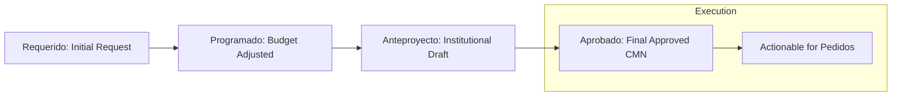

# Procedure: Multi-year Needs Programming (CMN)

The "Cuadro Multianual de Necesidades" (CMN) is the foundational planning procedure where the system models the identification and prioritization of institutional needs.

## Description
This procedure allows each Cost Center to plan the goods, services, and works required to fulfill their goals over a multi-year period (typically 4 years in this system).

## Sub-Procedures
1. **Identification of Needs**: Initial entry of required items by the Cost Center.
2. **Classification and Prioritization**: Categorizing items and determining their importance relative to budget constraints.
3. **Consolidation**: Aggregating needs across the organization.
4. **Approval**: Final authorization of the planned needs.

### CMN Programming Phases

## Key Steps
- **Item Selection**: Items are chosen from a standardized catalog (Suministros, Activos Fijos, Servicios, Obras).
- **Goal Mapping**: Every item must be associated with a specific budget "Meta" (Goal) and "Actividad Operativa" (Operating Activity).
- **Temporal Distribution**: Needs are distributed monthly across the years.
- **Budget Forecasting**: Recording "Obligaciones de Pago" (current contracts) and "Previsiones Presupuestales" (future forecasts).

## System Requirements
- **User Authorization**: The user must be assigned to a specific "Centro de Costo" (Cost Center) in their profile.
- **Master Data**:
    - **Metas**: Must be pre-loaded from the Configuration Module (typically via SIAF interface).
    - **Operating Activities**: Must be assigned to the relevant Cost Center.
    - **Funding Sources (FF/Rubro)**: Must be configured.
- **Catalog Consistency**: Items must exist in the system's institutional catalog with estimated prices.
