# Procedure: Order Management (Pedidos)

Order Management models the transition from planned needs to actionable requests for fulfillment or procurement.

## Description
This procedure handles the formal request for items by Cost Centers. The system distinguishes between items already planned and emergency or unplanned requirements.

## Types of Orders
1. **Scheduled Orders (Pedidos Programados)**: Based directly on the items approved in the CMN. These are constrained by the quantities and months defined in the planning phase.
2. **Purchase Orders (Pedidos de Compra B/S)**: Used for non-programmed needs. These require higher levels of justification and real-time budget validation.

## Key Steps
- **Order Entry**: Selecting the Meta, Activity, and employee responsible for receiving the items.
- **Item Insertion**: Adding specific items from the catalog or the approved CMN.
- **V°B° Jefe**: Internal approval by the head of the Cost Center.
- **Logistics Authorization**: Final review by the Logistics area to decide on fulfillment (from stock) or procurement (purchase).

### Order Authorization & Fulfillment Logic

```mermaid
flowchart TD
    Start([Order Created: PENDIENTE]) --> VB[V°B° Jefe: Internal Approval]
    VB --> Auth[Logistics Authorization Stage]
    Auth --> CheckStock{Check Warehouse Stock}
    
    CheckStock -- Stock Available --> Stock[Mark as STOCK]
    CheckStock -- No Stock --> Pptal[Mark as PPTAL]
    
    Stock --> Decision{Logistics Decision}
    Pptal --> Decision
    
    Decision -- Approve for Stock --> ApprovedStock[State: APROBADO]
    Decision -- Approve for Purchase --> ApprovedPurchase[State: APROBADO]
    Decision -- Deny --> Denied[State: DENEGADO]
    
    ApprovedStock --> PECOSA[Proceed to PECOSA]
    ApprovedPurchase --> Purchase[Trigger Purchase Order - OC]
```

## System Requirements
- **CMN Linkage**: For scheduled orders, the item must have a remaining balance in the approved CMN for the requested month.
- **Budget Validation**: For non-programmed orders, the system performs a real-time check against the "Saldo Presupuestal SIAF" (SIAF Budget Balance).
- **Justification**: Non-programmed orders require a formal "Justificación" field to be filled if the item was originally in the CMN but is being requested outside the plan.
- **Status Workflow**: Orders must pass through states: `PENDIENTE` -> `VB JEFE` -> `APROBADO`.
