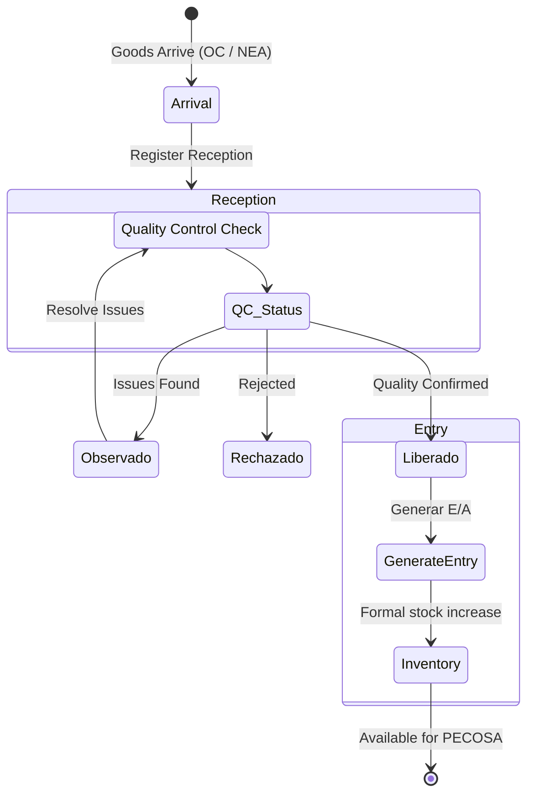

# Procedure: Warehouse Operations (Almacenes)

Warehouse operations model the lifecycle of goods within the organization, from entry to physical delivery.

## Sub-Procedures
1. **Reception (Recepción en Almacén)**: The physical arrival of goods.
    - Sources: Purchase Orders (OC) or Entry Notes (NEA).
    - Checks: Quantities received vs. ordered, quality control status (Liberado, Observado, Rechazado).

### Warehouse Reception & Entry Flow

2. **Entry (Entradas al Almacén)**: Formalizing the reception into inventory.
    - Only items in state `Liberado` can generate an Entry record.
3. **Fulfillment (Atención de Pedidos)**: Selecting stock to satisfy authorized orders.
    - Supports Total or Partial fulfillment based on stock availability.
4. **Exit Documentation (PECOSA)**: The "Pedido Comprobante de Salida" is the system's legal document for goods leaving the warehouse.
5. **Inventory Control**:
    - **Kardex**: Perpetual inventory tracking using the Weighted Average Price (Precio Promedio) method.
    - **Physical Inventory**: Periodic reconciliation procedure.

## Key Concepts
- **Lote Control**: Tracking expiration dates and batch numbers for sensitive items (e.g., medicine).
- **Physical Location (Ubicación Física)**: Hierarchical mapping of the warehouse (Zone -> Rack -> Shelf -> Column -> Bin).
- **Asset Integration**: Items identified as fixed assets (Activos Fijos) can be automatically transferred to the "Módulo de Patrimonio" upon entry.

## System Requirements
- **Documentation**: Every entry must be backed by a reference document (OC number or NEA number).
- **Sequentiality**: The system prevents actions if a previous step isn't finalized (e.g., cannot generate PECOSA without internal "Conformidad").
- **Budget Lock**: During authorization, the system "reserves" budget funds until the purchase or delivery is finalized.
