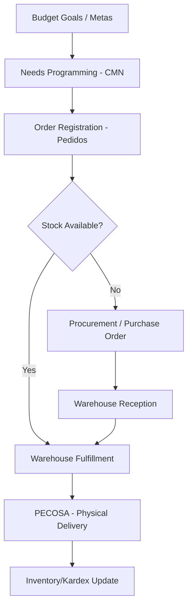

# Workflow: Integrated Logistics Lifecycle

The logistics system models a continuous flow from institutional goals to the physical delivery of goods.

## Higher Conceptual Workflow

## Key Relationships

### 1. Planning to Request (CMN -> Pedidos)
The system uses the **CMN** as a control ceiling. Scheduled orders are validated against the "programmed quantities" for that specific month and cost center. This ensures that spending aligns with the multi-year plan.

### 2. Request to Execution (Pedidos -> Almacén vs. Compras)
Upon authorization of an order, the system branches:
- If stock exists (`STOCK`), it directs the workflow to **Warehouse Fulfillment**.
- If stock is insufficient (`PPTAL`), it triggers a need for a **Purchase Order (OC)**.

### 3. Entry to Exit (Reception -> Entry -> PECOSA)
Goods entering via purchase or donation are not immediately available for fulfillment. They must pass through **Reception** (quality check) and **Entry** (official stock increase) before the **Order Fulfillment** procedure can select them for a **PECOSA**.

### 4. Logistics to Assets (Logística -> Patrimonio)
There is a specific bridge for **Fixed Assets**. When an item categorized as an asset enters the warehouse, the system prompts its registration in the Assets module, linking the logistics acquisition directly to the institutional inventory.

## Core Conceptual Model
The system is built on **Accountability and Budget Rigor**. No physical movement happens without a corresponding budget goal (Meta) and an authorized document (Pedido/OC/NEA/PECOSA).
